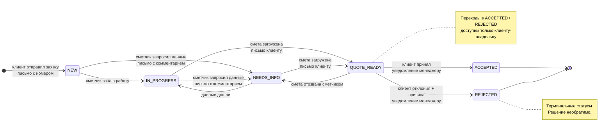

# RenovateAM — архитектура backend

Версия 0.1 · 23.08.2026 · статус: черновик под реализацию MVP

Документ описывает серверную часть: топологию, границы модулей, модель данных, контракты API, аутентификацию, работу с файлами и статусную машину заявки. Источники истины по продукту — [`README.md`](../README.md) и [`docs/MVP.md`](MVP.md); всё, чего в них нет, вынесено в раздел «Открытые вопросы», а не додумано.

---

## 1. Топология развёртывания

Два развёрнутых артефакта и три управляемых сервиса. Между фронтом и API — единственная граница: HTTPS REST.

```
                         ┌──────────────────────────────┐
   браузер клиента ─────►│  Netlify CDN                 │
   (ru / hy / en)        │  React SPA (статика)         │
                         │  pricing-core в бандле       │
                         └───────────────┬──────────────┘
                                         │ HTTPS, JSON, Bearer access-token
                                         ▼
                         ┌──────────────────────────────┐
                         │  Railway: NestJS API         │
                         │  модули: auth · pricing ·    │
                         │  requests · files ·          │
                         │  notifications · admin       │
                         └───┬──────────┬───────────┬───┘
                             │          │           │
              TLS, приватный │          │ S3 API    │ HTTPS
              connection str │          │ (ключи)   │ (API key)
                             ▼          ▼           ▼
                   ┌──────────────┐ ┌─────────┐ ┌──────────┐
                   │ PostgreSQL   │ │ CF R2   │ │ Resend   │
                   │ (Neon)       │ │ bucket  │ │ (email)  │
                   └──────────────┘ └────┬────┘ └──────────┘
                                         │ подписанный PUT/GET, TTL 15 мин
                     браузер клиента ◄───┘  (в обход API, напрямую)
```

**Границы доверия**

| Зона | Что внутри | Кому доверяем |
|---|---|---|
| Публичная (untrusted) | Браузер, SPA, содержимое форм, результат расчёта на клиенте | Ничему. Любой расчёт, пришедший с клиента, пересчитывается на сервере |
| API (trusted) | NestJS, все секреты, ключи S3, JWT-секреты, ключ Resend | Единственное место, где живут секреты |
| Данные | Neon, R2 | Доступны только API. Bucket приватный, публичного чтения нет |

Ключевые следствия:

- Клиент считает вилку локально ради мгновенного отклика (критерий приёмки US-1: «без обращения к серверу за ценой»), но при создании заявки сервер **пересчитывает** оценку заново по своей активной версии ставок и сохраняет свой результат. Присланные клиентом суммы игнорируются.
- Файлы никогда не проходят через API — только подписанные ссылки. API — плоскость управления, R2 — плоскость данных.
- CORS на API ограничен origin фронта (`APP_URL`). Rate limit — на уровне API (`@nestjs/throttler`), отдельно жёсткий для `/auth/*` и `/pricing/estimate`.

---

## 2. Границы модулей

### 2.1 Правило изоляции (механическое, не «по договорённости»)

Изоляция держится на трёх правилах, каждое из которых ломает сборку при нарушении:

1. **Структура каталогов.** Каждый модуль — `src/modules/<name>/` со строгим составом:

```
src/modules/requests/
├── requests.module.ts        # NestJS-модуль: exports: [RequestsService] и больше ничего
├── requests.service.ts       # публичный сервис = единственный вход для чужих модулей
├── requests.controller.ts    # HTTP, private
├── requests.repository.ts    # Prisma, private — НЕ экспортируется из модуля
├── dto/                      # DTO контроллера, private
└── public/                   # публичный контракт: index.ts, типы, порты
    └── index.ts              # единственный разрешённый импорт извне
```

2. **NestJS-провайдеры.** В `@Module({ exports: [...] })` попадает только публичный сервис. Репозиторий и `PrismaService` конкретного модуля не экспортируются — чужой модуль физически не может их заинжектить, DI бросит ошибку на старте.

```ts
@Module({
  imports: [PricingModule, NotificationsModule],
  controllers: [RequestsController],
  providers: [RequestsService, RequestsRepository], // репозиторий приватен
  exports: [RequestsService],                       // единственный публичный выход
})
export class RequestsModule {}
```

3. **ESLint-правило на импорты вглубь.** `@typescript-eslint/no-restricted-imports` запрещает любой путь внутрь чужого модуля, кроме `public` и самого класса NestJS-модуля `@modules/<name>/<name>.module` (он нужен для сборки графа зависимостей и доступа к внутренностям не даёт). Реальная конфигурация — в `eslint.config.mjs`:

```js
// eslint.config.mjs
'@typescript-eslint/no-restricted-imports': ['error', {
  // Рантайм Prisma-клиента — только в *.repository.ts; типы (import type) разрешены.
  paths: [{ name: '@db', allowTypeImports: true, message: '…' }],
  patterns: [
    { group: ['@modules/*/!(public|*.module)', '@modules/*/!(public)/**'], message: '…' },
    { group: ['@modules/*/*.repository', '@modules/*/*.service'], message: '…' },
    { group: ['../../**', '../*/*'], message: '…' }, // кросс-модульные относительные пути
  ],
}],
```

Третье правило — сильнее, чем задумывалось изначально: рантайм Prisma-клиента
недоступен ничему, кроме `*.repository.ts`, поэтому «сходить в чужую таблицу»
нельзя даже внутри своего модуля мимо репозитория. Перечисления `@db/enums` —
общий словарь домена и разрешены везде.

Дополнительно: **одна таблица — один владелец**. Записывать и читать таблицу через Prisma имеет право только модуль-владелец. Чужие данные берутся вызовом публичного сервиса. Для проверки в CI — линт-скрипт, который сопоставляет `prisma.<model>` в коде модуля со списком владельцев из `@owner` в `schema.prisma`.

Транзакции, пересекающие модули, не разрешены. Там, где нужна согласованность (создание заявки + фиксация оценки), владелец агрегата — `requests`, а `pricing` отдаёт ему уже посчитанное значение как данные.

### 2.2 Карта модулей

| Модуль | Ответственность | Владеет таблицами | Зависит от |
|---|---|---|---|
| `auth` | Регистрация, вход, JWT, верификация e-mail, роли | `users`, `verification_tokens`, `refresh_tokens` | `notifications` |
| `pricing` | Ставки, версионирование, движок расчёта, быстрые расчёты | `rate_versions`, `pricing_rates`, `quick_estimates` | — |
| `requests` | Заявки, статусная машина, журнал, решения клиента | `requests`, `status_log`, `decisions` | `pricing`, `files`, `notifications`, `auth` |
| `files` | Подписанные ссылки, метаданные файлов, валидация | `files` | `auth` (только гейт верификации) |
| `notifications` | Отправка писем через Resend, шаблоны, локализация | — (в MVP без своей таблицы) | — |
| `admin` | Очередь сметчика, загрузка смет, редактор ставок | `quotes` | `requests`, `pricing`, `files`, `auth` |

`notifications` и `pricing` — листья графа зависимостей: они ни к кому не обращаются, поэтому выносятся в отдельный сервис первыми и без изменений вызывающего кода.

### 2.3 Публичные интерфейсы

```ts
// modules/auth/public/index.ts
export interface AuthPublicService {
  /** Профиль пользователя без пароля и служебных полей. */
  getUserById(userId: string): Promise<PublicUser | null>;
  /** Верифицирован ли e-mail — гейт на отправку заявки. */
  isEmailVerified(userId: string): Promise<boolean>;
  /** Поиск клиентов с тем же телефоном для дедупликации в админке. */
  findUserIdsByPhone(phone: string): Promise<string[]>;
}
export interface PublicUser {
  id: string; fullName: string; email: string; phone: string;
  address: string; role: UserRole; locale: Locale; emailVerified: boolean;
}
```

```ts
// modules/pricing/public/index.ts
export interface PricingPublicService {
  /** Активный набор ставок с идентификатором версии. */
  getActiveRateSet(): Promise<RateSet>;
  /** Расчёт + сохранение quick_estimate. Фиксирует rate_version_id. */
  createQuickEstimate(input: EstimateInput, userId: string | null, locale: Locale): Promise<QuickEstimateView>;
  /** Чтение сохранённого расчёта — requests кладёт его снапшот в заявку. */
  getQuickEstimate(id: string): Promise<QuickEstimateView | null>;
  /** Привязка анонимных расчётов к пользователю после регистрации. */
  attachEstimatesToUser(estimateIds: string[], userId: string): Promise<void>;
}
export interface QuickEstimateView {
  id: string; needsManual: boolean; rateVersionId: string;
  amountBase: number | null; amountMin: number | null; amountMax: number | null;
  input: EstimateInput; expiresAt: string; createdAt: string;
}
```

```ts
// modules/files/public/index.ts
export interface FilesPublicService {
  /** Метаданные подтверждённых файлов заявки — для карточки в кабинете и админке. */
  listByRequest(requestId: string): Promise<FileMeta[]>;
  countByRequest(requestId: string): Promise<number>;
  /** Привязка загруженных черновиков к созданной заявке. Чужие файлы игнорируются. */
  attachToRequest(fileIds: string[], requestId: string, userId: string): Promise<FileMeta[]>;
  /** Загрузка серверного объекта (PDF-сметы) — используется admin. */
  putObject(key: string, body: Buffer, mime: string): Promise<void>;
  /** Подписанная ссылка на чтение произвольного ключа, TTL 15 минут. */
  createDownloadUrlForKey(key: string): Promise<{ url: string; expiresAt: string }>;
}
export interface FileMeta {
  id: string; requestId: string | null; kind: 'BTI' | 'DESIGN';
  originalName: string; mime: string; size: number; uploadedAt: string | null;
}
```

Авторизацию по файлам модуль `files` делает **сам, по `files.user_id`**, и потому не
зависит от `requests`. Это осознанное изменение относительно первого черновика:
файл загружается ДО создания заявки (US-3 допускает отправку заявки со ссылками на
уже загруженные файлы), поэтому `request_id` обязан быть nullable, а владельца надо
знать с самого начала. Побочный выигрыш — отсутствие цикла `files ↔ requests`.

```ts
// modules/requests/public/index.ts
export interface RequestsPublicService {
  getById(requestId: string): Promise<RequestView | null>;
  /** Есть ли у клиента активная заявка (гейт «одна активная заявка»). */
  hasActiveRequest(userId: string): Promise<boolean>;
  /** Смена статуса из admin. Единственная точка перехода статусов. */
  transitionStatus(cmd: TransitionCommand): Promise<RequestView>;
  /** Проверка владения — files и admin спрашивают «этот файл чей?». */
  isOwnedBy(requestId: string, userId: string): Promise<boolean>;
}
export interface TransitionCommand {
  requestId: string;
  to: RequestStatus;
  actor: { id: string; role: UserRole };
  comment?: string;
  /**
   * Есть ли у заявки актуальная смета. Признак передаёт владелец таблицы
   * `quotes` (модуль admin): инвариант «QUOTE_READY только при наличии сметы»
   * проверяет requests, но чужую таблицу не читает — и цикла admin ↔ requests
   * не возникает.
   */
  hasCurrentQuote?: boolean;
}
```

```ts
// modules/notifications/public/index.ts
export type NotificationEvent =
  | { type: 'EMAIL_VERIFICATION'; to: string; locale: Locale; link: string }
  | { type: 'REQUEST_SUBMITTED'; to: string; locale: Locale; requestNumber: number }
  | { type: 'REQUEST_NEEDS_INFO'; to: string; locale: Locale; requestNumber: number; comment: string }
  | { type: 'QUOTE_READY'; to: string; locale: Locale; requestNumber: number }
  | { type: 'DECISION_MADE'; to: string; locale: Locale; requestNumber: number; result: DecisionResult };

export interface NotificationsPublicService {
  /** Fire-and-forget: ошибка доставки не роняет бизнес-операцию, пишется в лог. */
  send(event: NotificationEvent): Promise<void>;
}
```

`admin` публичного интерфейса не экспортирует — к нему никто не обращается изнутри API.

---

## 3. Движок расчёта (`packages/pricing-core`)

### 3.1 Почему отдельный пакет

Одна реализация исполняется в двух средах: в браузере (US-1: результат «мгновенно, без обращения к серверу за ценой») и в API (источник истины, результат которого попадает в БД). Расхождение клиентской и серверной цены — прямой репутационный риск, поэтому реализация ровно одна, а не две «синхронизированные».

Пакет не зависит от NestJS, Prisma, DOM и переменных окружения. Функция чистая: нет `Date.now()`, нет случайности, нет ввода-вывода. Отсюда — тривиальные unit-тесты и возможность прогонять один и тот же набор кейсов на обеих сторонах.

### 3.2 Типы

```ts
export interface EstimateInput {
  readonly areaSqm: number;                 // 10…1000
  readonly objectType: 'APARTMENT' | 'HOUSE';
  readonly workScope: 'TURNKEY' | 'FINISHING' | 'ROUGH';
  readonly finishPackage: 'STANDARD' | 'DESIGNER';
  readonly condition: 'NEW_BUILDING' | 'SECONDARY_WITH_DEMOLITION';
  readonly ceilingHeight: 'UP_TO_3M' | 'FROM_3M';
}

export interface RateSet {
  readonly versionId: string;               // rate_versions.id
  readonly baseRateAmd: number;             // целое число драмов, по умолчанию 60 000
  readonly workScope: Readonly<Record<WorkScope, number>>;
  readonly objectType: Readonly<Record<ObjectType, number>>;
  readonly condition: Readonly<Record<PropertyCondition, number>>;
  readonly ceilingHeight: Readonly<Record<CeilingHeight, number>>;
  readonly rangeMin: number;                // 0.85
  readonly rangeMax: number;                // 1.15
}

export interface AutomaticEstimateResult {
  readonly needsManualReview: false;
  readonly rateVersionId: string;
  readonly amountBase: number;              // целые драмы
  readonly amountMin: number;
  readonly amountMax: number;
  readonly applied: AppliedCoefficients;    // все четыре применённых множителя
  readonly currency: 'AMD';
}

export interface ManualReviewResult {
  readonly needsManualReview: true;
  readonly rateVersionId: string;
  readonly reason: 'DESIGNER_PACKAGE';      // сумм нет — намеренно
}

export type EstimateResult = AutomaticEstimateResult | ManualReviewResult;

export function calculateEstimate(input: EstimateInput, rates: RateSet): EstimateResult;
export function buildRateSet(versionId: string, values: Record<string, number>): RateSet;
export function assertValidArea(areaSqm: number): void; // бросает EstimateValidationError
```

Дискриминированное объединение по `needsManualReview` — не стилистика: при дизайнерском пакете суммы отсутствуют на уровне типа, и код, который попытается их показать, не скомпилируется. Требование «цена не показывается» (US-1) обеспечено компилятором, а не дисциплиной.

### 3.3 Формула

```
base = areaSqm × baseRateAmd × К_объём × К_объект × К_состояние × К_потолки
min  = round(base × rangeMin)     // rangeMin = 0.85
max  = round(base × rangeMax)     // rangeMax = 1.15
```

Пример из README: `80 × 60 000 × 1.0 × 1.0 × 1.0 × 1.0 = 4 800 000` → `4 080 000 … 5 520 000 AMD`.

Округление — единственное, в одной функции `toAmd = Math.round`, применяется к финальным суммам, не к промежуточным множителям. Клиент и сервер обязаны получить бит-в-бит одинаковый результат; расхождение — баг, ловится тестом с общим набором кейсов.

### 3.4 Версионирование ставок и фиксация `rate_version_id`

- Набор ставок хранится в `pricing_rates`, сгруппированный в `rate_versions`. Редактирование в админке **не изменяет строки**, а создаёт новую версию и переключает `is_active`. Старые версии не удаляются никогда (US-7).
- Каждый расчёт (`quick_estimates.rate_version_id`) хранит версию, по которой он сделан. Это даёт три вещи, каждая из которых требуется явно:
  1. **Воспроизводимость.** Оценку, выданную клиенту месяц назад, можно пересчитать и объяснить.
  2. **Отсутствие ретроактивного пересчёта.** «Новые расчёты используют актуальную версию; ранее выданные оценки не пересчитываются» (US-7).
  3. **Устойчивость к гонке.** «Админ поменял ставки во время расчёта → расчёт завершается по версии, зафиксированной на старте» (Edge cases). Реализация: `getActiveRateSet()` вызывается один раз в начале обработки запроса, дальше по коду ходит уже конкретный `RateSet` с `versionId`.
- `GET /pricing/rates` отдаёт активную версию вместе с `versionId`; клиент считает по ней и присылает `rateVersionId` вместе с параметрами. Если присланная версия больше не активна, сервер пересчитывает по актуальной и возвращает свой результат — клиентское значение никогда не принимается на веру.
- Срок жизни расчёта — 30 дней (`quick_estimates.expires_at`). Просроченный расчёт нельзя приложить к заявке: требуется пересчёт по актуальной версии (Edge cases).

---

## 4. Модель данных

PostgreSQL, Prisma. Полная схема — [`apps/api/prisma/schema.prisma`](../apps/api/prisma/schema.prisma).

**Миграции и клиент.** `prisma migrate` не используется: schema-engine Prisma требует
загрузки бинарников с `binaries.prisma.sh`, недоступной в среде разработки. Миграции —
обычные `.sql`-файлы в `prisma/migrations/*/migration.sql`, применяются идемпотентным
скриптом `pnpm db:setup` с отметкой в таблице `_migrations`. Побочная выгода: частичные
уникальные индексы и CHECK-constraint'ы, которые Prisma не выражает декларативно,
живут там же, где остальная схема. Клиент генерируется генератором `prisma-client`
с `engineType = "client"` и работает через driver adapter `@prisma/adapter-pg` —
бинарные движки не нужны ни в разработке, ни в проде.

Общие соглашения:

- Первичные ключи — `uuid` (`@db.Uuid`), кроме человекочитаемого `requests.number` (`serial`).
- Все временные метки — `timestamptz(3)`, UTC.
- **Деньги — `Int` в драмах.** Никакого `float`/`double`. Минимальная единица AMD — 1 драм, дробей не бывает; `Int` покрывает суммы до ~2.1 млрд AMD, что заведомо выше любой сметы на квартиру.
- Множители — `Decimal(14,4)`: точность важнее скорости, значений мало и читаются они редко.
- Площадь — `Decimal(7,2)` (до 99 999.99 м²), не `Float`.

| Таблица | Владелец | Назначение |
|---|---|---|
| `users` | auth | Учётные записи всех ролей |
| `verification_tokens` | auth | Одноразовые ссылки верификации e-mail |
| `refresh_tokens` | auth | Ротация и отзыв refresh-токенов |
| `rate_versions` | pricing | Версии набора ставок |
| `pricing_rates` | pricing | Ставки и коэффициенты внутри версии |
| `quick_estimates` | pricing | Сохранённые быстрые расчёты, в т.ч. анонимные |
| `requests` | requests | Заявки |
| `status_log` | requests | Журнал смены статусов |
| `decisions` | requests | Решение клиента по смете |
| `files` | files | Файлы клиента (БТИ, дизайн) |
| `quotes` | admin | PDF-сметы сметчика |

### 4.1 `users` (auth)

| Поле | Тип | Ограничения |
|---|---|---|
| `id` | uuid | PK |
| `full_name` | varchar(200) | not null |
| `email` | varchar(320) | not null, **unique** |
| `email_verified_at` | timestamptz | null = не верифицирован |
| `phone` | varchar(20) | not null, E.164 `+374XXXXXXXX`, **не уникален** |
| `address` | varchar(500) | not null — адрес объекта |
| `password_hash` | varchar(72) | bcrypt, cost ≥ 10 |
| `role` | enum UserRole | default `CLIENT` |
| `locale` | enum Locale | default `RU` |
| `created_at`, `updated_at` | timestamptz | |

Индексы: `(phone)` — дедупликация заявок в админке; `(role)` — список сотрудников.

Телефон намеренно **не уникален**: верификации телефона нет, уникальность превратилась бы в вектор блокировки чужой регистрации. Дубли решаются склейкой карточек в админке, а не ограничением БД (Edge cases).

`password_hash` — 72 символа: bcrypt-хеш ровно 60 символов, запас на смену алгоритма.

### 4.2 `verification_tokens` (auth)

| Поле | Тип | Ограничения |
|---|---|---|
| `id` | uuid | PK |
| `user_id` | uuid | FK → users, **on delete cascade** |
| `token_hash` | char(64) | **unique**, SHA-256 от токена из письма |
| `expires_at` | timestamptz | not null, +24 ч |
| `used_at` | timestamptz | null = не использован |
| `created_at` | timestamptz | |

Индексы: `(user_id, created_at)` — поиск последнего выпущенного токена для антиспама «отправить повторно»; `(expires_at)` — чистка.

В БД лежит хеш, а не сам токен: дамп БД не даёт возможности верифицировать чужие адреса.

### 4.3 `refresh_tokens` (auth)

| Поле | Тип | Ограничения |
|---|---|---|
| `id` | uuid | PK |
| `user_id` | uuid | FK → users, cascade |
| `token_hash` | char(64) | unique, SHA-256 |
| `family_id` | uuid | цепочка ротации |
| `expires_at` | timestamptz | +30 дней |
| `revoked_at` | timestamptz | null = активен |
| `user_agent`, `ip` | varchar | для журнала сессий |

Индексы: `(user_id, revoked_at)`, `(family_id)`, `(expires_at)`.

Таблицы нет в списке MVP §5 — добавлена как следствие требования «JWT + refresh» из README: без хранения отозвать refresh невозможно.

### 4.4 `rate_versions` и `pricing_rates` (pricing)

`rate_versions`: `id`, `created_by` (FK → users, on delete **set null** — увольнение админа не должно удалять историю цен), `note`, `is_active`, `created_at`. Индексы `(is_active, created_at)`, `(created_at)`.

Активная версия ровно одна — частичным уникальным индексом в миграции (Prisma такое не выражает декларативно):

```sql
CREATE UNIQUE INDEX rate_versions_single_active
  ON rate_versions (is_active) WHERE is_active = true;
```

`pricing_rates`: `id`, `version_id` (FK → rate_versions, **cascade**), `key` varchar(64), `value` `Decimal(14,4)`. Уникальность `(version_id, key)`.

Ключи: `base_rate_amd`, `scope_turnkey`, `scope_finishing`, `scope_rough`, `object_apartment`, `object_house`, `condition_new`, `condition_secondary`, `ceiling_up_to_3m`, `ceiling_from_3m`, `range_min`, `range_max`.

Схема «ключ-значение» вместо колонок выбрана сознательно: добавление нового коэффициента (например, надбавки за санузел — открытый вопрос №2 MVP) не требует миграции, только новую версию с новым ключом. Плата — отсутствие проверки полноты на уровне БД; её берёт на себя `buildRateSet()`, подставляя значения по умолчанию для отсутствующих ключей, и валидация в админке при создании версии.

### 4.5 `quick_estimates` (pricing)

| Поле | Тип | Комментарий |
|---|---|---|
| `id` | uuid | PK |
| `user_id` | uuid? | FK → users, **set null**. null = анонимный расчёт |
| `area_sqm` | decimal(7,2) | |
| `object_type`, `work_scope`, `finish_package`, `condition`, `ceiling_height` | enum | входные параметры |
| `amount_min`, `amount_max`, `amount_base` | int? | **null при `DESIGNER`** |
| `needs_manual` | bool | true при `DESIGNER` |
| `rate_version_id` | uuid | FK → rate_versions, **on delete restrict** |
| `expires_at` | timestamptz | +30 дней |
| `locale` | enum | язык, на котором сделан расчёт (аналитика) |
| `created_at` | timestamptz | |

Индексы: `(user_id, created_at)`, `(created_at)` — воронка по датам, `(rate_version_id)`.

`on delete restrict` на версию ставок: версию, по которой выдавались оценки, удалить нельзя. `on delete set null` на пользователя: удаление аккаунта не должно ломать анонимизированную аналитику.

Суммы `nullable` — прямое отражение требования «при дизайнерском пакете цена не показывается»: несуществующей цены нет и в базе, показать её неоткуда.

### 4.6 `requests` (requests)

| Поле | Тип | Комментарий |
|---|---|---|
| `id` | uuid | PK |
| `number` | serial | **unique**, номер заявки для писем и админки |
| `user_id` | uuid | FK → users, cascade |
| `quick_estimate_id` | uuid? | FK → quick_estimates, **unique**, set null |
| `status` | enum RequestStatus | default `NEW` |
| `needs_manual` | bool | снапшот маршрутизации |
| `comment` | varchar(2000) | комментарий клиента / сметчика |
| `created_at`, `updated_at` | timestamptz | |

Индексы: `(status, created_at)` — **основной запрос очереди сметчика** (US-5: фильтр по статусу + сортировка по дате); `(user_id, created_at)` — кабинет клиента.

`quick_estimate_id` уникален: один расчёт нельзя приложить к двум заявкам. Nullable — заявка при дизайнерском пакете может не иметь автооценки.

Требование «активная заявка у клиента одна» (US-4) выражается частичным уникальным индексом:

```sql
CREATE UNIQUE INDEX requests_one_active_per_user
  ON requests (user_id) WHERE status IN ('NEW','IN_PROGRESS','NEEDS_INFO','QUOTE_READY');
```

Это гонко-устойчиво, в отличие от проверки «сначала SELECT, потом INSERT».

### 4.7 `status_log` (requests)

`id`, `request_id` (FK, cascade), `from_status` (nullable — создание заявки), `to_status`, `actor_id` (FK → users, set null), `comment` varchar(2000), `created_at`. Индексы `(request_id, created_at)`, `(actor_id, created_at)`.

Пишется в той же транзакции, что и смена `requests.status`. Запись только вставкой; update и delete запрещены на уровне кода (журнал append-only).

### 4.8 `decisions` (requests)

`id`, `request_id` (FK, cascade, **unique** — решение необратимо и единственно), `result` enum, `reason` enum?, `comment` varchar(2000)?, `created_at`. Индекс `(result, created_at)` — отчёт по причинам отказов.

Ограничения `reason` обязателен при `result = REJECTED` и `comment` обязателен при `reason = OTHER` проверяются в сервисе и дублируются CHECK-constraint в миграции:

```sql
ALTER TABLE decisions ADD CONSTRAINT decisions_reason_required
  CHECK (result <> 'REJECTED' OR reason IS NOT NULL);
ALTER TABLE decisions ADD CONSTRAINT decisions_other_comment_required
  CHECK (reason <> 'OTHER' OR (comment IS NOT NULL AND length(btrim(comment)) > 0));
```

### 4.9 `files` (files)

| Поле | Тип | Комментарий |
|---|---|---|
| `id` | uuid | PK |
| `user_id` | uuid | FK → users, cascade. **Владелец файла**, заполняется всегда |
| `request_id` | uuid? | FK → requests, cascade. null = черновик до создания заявки |
| `kind` | enum FileKind | `BTI` / `DESIGN` |
| `original_name` | varchar(300) | как назвал файл клиент |
| `storage_key` | varchar(500) | **unique**, ключ объекта в R2 |
| `mime` | varchar(150) | |
| `size` | int | байты, подтверждены HEAD-запросом к R2 |
| `uploaded_at` | timestamptz? | null = ссылка выдана, загрузка не подтверждена |
| `created_at` | timestamptz | |

Индексы: `(request_id, kind)` — карточка заявки с разбивкой на два раздела; `(user_id, request_id)` — черновики клиента и проверка владения; `(uploaded_at)` — фоновая чистка неподтверждённых записей старше 24 ч.

`user_id` отсутствует в модели данных MVP §5 и добавлен намеренно: без него нельзя ни авторизовать доступ к файлу, загруженному до создания заявки, ни отличить чужой черновик от своего.

Двухфазность (`created_at` → `uploaded_at`) обязательна: клиент может получить ссылку и не загрузить файл. Пока `uploaded_at IS NULL`, файла для системы не существует.

### 4.10 `quotes` (admin)

`id`, `request_id` (FK, cascade), `author_id` (FK → users, set null), `file_key` varchar(500) **unique**, `total_amount` **int** (драмы), `is_current` bool, `created_at`. Индексы `(request_id, created_at)`, `(author_id)`.

Несколько смет на заявку допускаются намеренно: «Сметчик загрузил смету не в ту заявку → замена файла с записью в журнал» (Edge cases). Старая запись не удаляется, у неё снимается `is_current`; клиенту показывается только текущая.

---

## 5. Контракты API

Базовый префикс — `/api/v1`. Все ответы — JSON. Даты — ISO 8601 UTC. Суммы — целые числа драмов; форматирование (`4 800 000 ֏`) — задача фронта.

Легенда доступа: **public** — без токена; **client** — роль `CLIENT`; **verified** — плюс подтверждённый e-mail; **staff** — `ESTIMATOR` или `ADMIN`; **admin** — только `ADMIN`.

### 5.1 auth

```ts
// POST /auth/register — public
interface RegisterDto {
  fullName: string;      // 2..200
  email: string;
  phone: string;         // +374XXXXXXXX
  address: string;       // 5..500
  password: string;      // ≥8, минимум одна буква и одна цифра
  locale: 'RU' | 'HY' | 'EN';
  quickEstimateIds?: string[]; // анонимные расчёты, привязываются к аккаунту
}
interface RegisterResponse { userId: string; emailVerificationSent: true }
// 201 · 409 EMAIL_ALREADY_REGISTERED · 422 VALIDATION_FAILED · 429 RATE_LIMITED
```

```ts
// POST /auth/verify — public
interface VerifyDto { token: string }
interface VerifyResponse { verified: true }
// 200 · 400 TOKEN_INVALID · 409 TOKEN_ALREADY_USED · 410 TOKEN_EXPIRED
```

```ts
// POST /auth/resend-verification — client
interface ResendResponse { sent: true; nextAllowedAt: string }
// 202 · 409 ALREADY_VERIFIED · 429 RESEND_TOO_SOON (Retry-After в секундах)
```

```ts
// POST /auth/login — public
interface LoginDto { email: string; password: string }
interface LoginResponse {
  accessToken: string;   // 15 минут
  user: { id: string; fullName: string; email: string; role: UserRole;
          locale: Locale; emailVerified: boolean };
}                        // refresh — в httpOnly cookie, не в теле
// 200 · 401 INVALID_CREDENTIALS · 429 RATE_LIMITED
```

```ts
// POST /auth/refresh — cookie
interface RefreshResponse { accessToken: string }
// 200 · 401 REFRESH_INVALID (при повторном использовании отзывается вся цепочка)

// POST /auth/logout — client · 204

// GET /auth/me — client
interface MeResponse { id: string; fullName: string; email: string; phone: string;
  address: string; role: UserRole; locale: Locale; emailVerified: boolean }
```

### 5.2 pricing

```ts
// GET /pricing/rates — public, кэш 60 с
interface RatesResponse {
  versionId: string;
  baseRateAmd: number;                          // 60000
  workScope: Record<WorkScope, number>;
  objectType: Record<ObjectType, number>;
  condition: Record<PropertyCondition, number>;
  ceilingHeight: Record<CeilingHeight, number>;
  rangeMin: number; rangeMax: number;
  validityDays: 30;
}
// 200
```

```ts
// POST /pricing/estimate — public. Сохраняет расчёт для аналитики (US-1).
interface EstimateDto {
  areaSqm: number; objectType: ObjectType; workScope: WorkScope;
  finishPackage: FinishPackage; condition: PropertyCondition;
  ceilingHeight: CeilingHeight; locale: Locale;
}
type EstimateResponse =
  | { id: string; needsManualReview: false; rateVersionId: string;
      amountBase: number; amountMin: number; amountMax: number;
      currency: 'AMD'; expiresAt: string }
  | { id: string; needsManualReview: true; rateVersionId: string;
      reason: 'DESIGNER_PACKAGE'; expiresAt: string };
// 201 · 422 AREA_OUT_OF_RANGE · 429 RATE_LIMITED
```

Эндпоинт не является источником цены для UI — цену UI считает локально. Он нужен, чтобы расчёт попал в БД для воронки и чтобы его можно было приложить к заявке.

### 5.3 requests

```ts
// POST /requests — verified
interface CreateRequestDto {
  quickEstimateId?: string;   // если расчёт был
  comment?: string;           // ≤2000
  fileIds?: string[];         // подтверждённые файлы, ≤10
}
interface RequestResponse {
  id: string; number: number; status: RequestStatus; needsManual: boolean;
  comment: string | null; createdAt: string; updatedAt: string;
  estimate: QuickEstimateView | null;
  files: FileMeta[];
  quote: { id: string; totalAmount: number; createdAt: string } | null;
  decision: { result: DecisionResult; reason: RejectionReason | null;
              comment: string | null; createdAt: string } | null;
}
// 201 · 403 EMAIL_NOT_VERIFIED · 409 ACTIVE_REQUEST_EXISTS
// 410 ESTIMATE_EXPIRED · 422 VALIDATION_FAILED
```

```ts
// GET /requests/me — client → RequestResponse[]  (200)
// GET /requests/:id — client (только своя) → RequestResponse
//   200 · 403 FORBIDDEN · 404 NOT_FOUND
```

```ts
// POST /requests/:id/decision — verified, только владелец
interface DecisionDto {
  result: 'ACCEPTED' | 'REJECTED';
  reason?: RejectionReason;   // обязателен при REJECTED
  comment?: string;           // обязателен при reason = OTHER
}
// 201 → RequestResponse
// 403 FORBIDDEN · 409 DECISION_ALREADY_MADE
// 409 INVALID_STATUS_TRANSITION (статус ≠ QUOTE_READY) · 422 VALIDATION_FAILED
```

### 5.4 files

```ts
// POST /files/upload-url — verified
interface UploadUrlDto {
  requestId?: string;    // если заявка ещё не создана — черновик текущего пользователя
  kind: 'BTI' | 'DESIGN';
  originalName: string;
  mime: string;          // application/pdf | image/jpeg | image/png | image/vnd.dwg
  size: number;          // ≤ 26_214_400 (25 МБ)
}
interface UploadUrlResponse {
  fileId: string; uploadUrl: string; expiresAt: string;
  requiredHeaders: Record<string, string>;  // Content-Type, Content-Length
}
// 201 · 403 FORBIDDEN · 409 FILE_LIMIT_REACHED (>10)
// 415 UNSUPPORTED_MEDIA_TYPE · 413 FILE_TOO_LARGE
```

```ts
// POST /files/:id/confirm — verified, только владелец
interface ConfirmResponse { id: string; uploadedAt: string; size: number }
// 200 · 404 NOT_FOUND · 409 UPLOAD_NOT_FOUND (объекта нет в R2)
// 413 FILE_TOO_LARGE (фактический размер больше заявленного)

// DELETE /files/:id — verified, владелец, только до отправки заявки · 204

// GET /files/:id/download-url — client (владелец) | staff
interface DownloadUrlResponse { url: string; expiresAt: string }  // TTL 15 минут
// 200 · 403 FORBIDDEN · 404 NOT_FOUND
```

### 5.5 admin

```ts
// GET /admin/requests — staff
interface AdminRequestsQuery {
  status?: RequestStatus; phone?: string;   // поиск дублей
  page?: number; pageSize?: number;         // default 1 / 20
  sort?: 'createdAt:asc' | 'createdAt:desc';
}
interface AdminRequestsResponse {
  items: Array<{
    id: string; number: number; status: RequestStatus; needsManual: boolean;
    createdAt: string;
    client: { id: string; fullName: string; email: string; phone: string; address: string };
    estimateSummary: { amountMin: number; amountMax: number } | null;
    filesCount: number;
    duplicatePhoneCount: number;            // >1 → склейка карточек
  }>;
  total: number; page: number; pageSize: number;
}
// 200 · 403 FORBIDDEN
```

```ts
// GET /admin/requests/:id — staff → RequestResponse + client + statusLog[]

// PATCH /admin/requests/:id/status — staff
interface ChangeStatusDto { to: RequestStatus; comment?: string } // обязателен при NEEDS_INFO
// 200 → RequestResponse
// 409 INVALID_STATUS_TRANSITION · 422 COMMENT_REQUIRED

// POST /admin/requests/:id/quote — staff, multipart/form-data
// поля: file (PDF, ≤25 МБ), totalAmount (int, драмы)
interface QuoteResponse { id: string; totalAmount: number; createdAt: string; isCurrent: boolean }
// 201 · 409 INVALID_STATUS_TRANSITION · 415 UNSUPPORTED_MEDIA_TYPE
```

```ts
// GET /admin/pricing/rates/versions — admin
interface RateVersionsResponse {
  items: Array<{ id: string; isActive: boolean; note: string | null;
                 createdAt: string; createdBy: { id: string; fullName: string } | null;
                 rates: Record<string, number> }>;
}

// PUT /admin/pricing/rates — admin → создаёт НОВУЮ версию, старую не трогает
interface UpdateRatesDto { rates: Record<string, number>; note?: string }
interface UpdateRatesResponse { versionId: string; createdAt: string }
// 201 · 403 FORBIDDEN · 422 VALIDATION_FAILED (неизвестный ключ или value ≤ 0)

// GET /admin/users — admin → список пользователей с ролями (пагинация)
```

### 5.6 Полный список реализованных эндпоинтов

Базовый префикс — `/api/v1`. Таблица отражает фактическую реализацию: фронту
следует ориентироваться на неё.

| Метод и путь | Доступ | Назначение |
|---|---|---|
| `POST /auth/register` | public | Регистрация + письмо верификации |
| `POST /auth/verify` | public | Подтверждение e-mail по токену |
| `POST /auth/resend-verification` | client | Повторное письмо, не чаще 1/60 с |
| `POST /auth/login` | public | access в теле, refresh в cookie |
| `POST /auth/refresh` | cookie | Ротация пары токенов |
| `POST /auth/logout` | public | Отзыв цепочки refresh, очистка cookie |
| `GET /auth/me` | client | Профиль текущего пользователя |
| `GET /pricing/rates` | public | Активная версия ставок |
| `POST /pricing/estimate` | public | Расчёт + сохранение для аналитики |
| `POST /requests` | verified | Создать заявку |
| `GET /requests/me` | client | Свои заявки |
| `GET /requests/:id` | client (своя) / staff | Заявка целиком |
| `POST /requests/:id/decision` | verified (владелец) | Принять / отклонить смету |
| `POST /files/upload-url` | verified | Подписанная ссылка на загрузку |
| `POST /files/:id/confirm` | verified (владелец) | Подтверждение загрузки (HEAD в R2) |
| `GET /files/drafts` | client | Свои черновики до создания заявки |
| `GET /files/:id/download-url` | client (свой) / staff | Ссылка на скачивание, 15 мин |
| `DELETE /files/:id` | verified (владелец) | Удалить черновик до отправки |
| `GET /admin/requests` | staff | Очередь: статус, телефон, страницы, сортировка |
| `GET /admin/requests/:id` | staff | Карточка: заявка, клиент, файлы, смета, журнал |
| `PATCH /admin/requests/:id/status` | staff | Смена статуса |
| `POST /admin/requests/:id/quote` | staff | Загрузка PDF-сметы (multipart) |
| `GET /admin/requests/:id/quote/download-url` | staff | Ссылка на смету |
| `GET /admin/pricing/rates/versions` | admin | История версий ставок |
| `PUT /admin/pricing/rates` | admin | Новая версия ставок |
| `GET /admin/users` | admin | Список пользователей |

---

## 6. Аутентификация и авторизация

### 6.1 Токены

| Токен | Формат | TTL | Где хранится |
|---|---|---|---|
| access | JWT HS256, payload `{ sub, role, emailVerified, jti, iat, exp }` | **15 минут** | Память SPA (переменная в TanStack Query / React-контексте). **не** в `localStorage` |
| refresh | Непрозрачная случайная строка 32 байта (base64url) | **30 дней** | httpOnly + Secure + SameSite=Strict cookie, path `/api/v1/auth` |

Access — в памяти: XSS не вытащит его из `localStorage`, при перезагрузке страницы SPA молча делает `/auth/refresh`. Refresh — непрозрачный, а не JWT: его нужно уметь отзывать, а отзывать JWT без хранилища нельзя. В БД лежит SHA-256 хеш.

`emailVerified` в payload — справочное поле для UI. **`EmailVerifiedGuard` читает статус из БД** через `AuthPublicService.isEmailVerified()`: иначе после подтверждения адреса клиенту пришлось бы ждать до 15 минут, пока протухнет старый access-токен. Цена — один запрос к `users` на защищённый эндпоинт; корректность здесь важнее.

### 6.2 Ротация refresh

При каждом `/auth/refresh` старый токен помечается `revoked_at`, выдаётся новый в том же `family_id`. Если приходит уже отозванный токен — это признак кражи: **отзывается вся цепочка** (`UPDATE refresh_tokens SET revoked_at = now() WHERE family_id = ?`), пользователь разлогинивается везде, событие пишется в лог с уровнем `warn`.

### 6.3 Guard-ы

```ts
@UseGuards(JwtAuthGuard)                       // валидный access
@UseGuards(JwtAuthGuard, RolesGuard) @Roles('ADMIN')
@UseGuards(JwtAuthGuard, EmailVerifiedGuard)   // 403 EMAIL_NOT_VERIFIED
@UseGuards(JwtAuthGuard, RequestOwnerGuard)    // :id принадлежит req.user
```

`JwtAuthGuard` включён глобально; публичные эндпоинты помечаются декоратором `@Public()`. Дефолт — «закрыто»: забытый декоратор делает эндпоинт недоступным, а не открытым.

`RequestOwnerGuard` спрашивает `RequestsPublicService.isOwnedBy()` — единственный способ проверить владение, границы модулей не нарушаются.

Роли `ESTIMATOR` и `ADMIN` в MVP различаются только доступом к `/admin/pricing/*` и `/admin/users` (MVP §3: «разделение прав — после MVP»).

### 6.4 Поток верификации e-mail

1. `POST /auth/register` → создаётся `users` с `email_verified_at = null`, генерируется токен `randomBytes(32).toString('base64url')`, в БД сохраняется его SHA-256 с `expires_at = now() + 24h`.
2. `notifications.send({ type: 'EMAIL_VERIFICATION', link: `${APP_URL}/verify?token=…` })` через Resend.
3. `POST /auth/verify` → хеширует токен, ищет запись. Проверки по порядку: не найдено → `400 TOKEN_INVALID`; `used_at != null` → `409 TOKEN_ALREADY_USED`; `expires_at < now()` → `410 TOKEN_EXPIRED`. Успех: в одной транзакции `used_at = now()`, `users.email_verified_at = now()`, **все остальные активные токены пользователя гасятся**.
4. До верификации пользователь входит в кабинет, но `EmailVerifiedGuard` блокирует `POST /requests` и загрузку файлов (US-2).

**Антиспам повторной отправки.** `POST /auth/resend-verification`: если `max(created_at)` токенов пользователя моложе 60 секунд → `429 RESEND_TOO_SOON` с `Retry-After` и `nextAllowedAt` в теле. Окно считается по БД, а не по памяти процесса, — на Railway может работать несколько инстансов. Дополнительно суточный лимит 10 писем на адрес (защита от использования как почтового ретранслятора). Ответ на `resend` не зависит от того, существует ли адрес, — чтобы эндпоинт не работал как перечислитель пользователей.

Пароли — bcrypt, cost 12 (требование MVP: ≥10). Ответ `/auth/login` одинаков для «нет такого e-mail» и «неверный пароль»: `401 INVALID_CREDENTIALS`.

---

## 7. Работа с файлами

### 7.1 Поток загрузки

```
Клиент                        API                          R2
  │  POST /files/upload-url    │                             │
  │  {kind, name, mime, size}  │                             │
  ├───────────────────────────►│ валидация mime/size/лимита  │
  │                            │ INSERT files (uploaded_at=∅)│
  │                            │ presign PUT, TTL 15 мин ────►│
  │◄───────────────────────────┤ {fileId, uploadUrl}         │
  │                            │                             │
  │  PUT uploadUrl (тело файла, минуя API) ──────────────────►│
  │◄─────────────────────────────────────────────── 200 ─────┤
  │  POST /files/:id/confirm   │                             │
  ├───────────────────────────►│ HEAD объекта ──────────────►│
  │                            │◄─ size, content-type ───────┤
  │                            │ сверка, UPDATE uploaded_at  │
  │◄───────────────────────────┤ 200                         │
```

Почему так: файлы до 25 МБ × 10 штук не должны занимать память и трафик API-инстанса на Railway. API остаётся плоскостью управления.

Ключ объекта строится сервером, клиент на него не влияет:

```
requests/{requestId}/{kind}/{fileId}.{ext}     // файлы клиента
quotes/{requestId}/{quoteId}.pdf               // сметы
```

`fileId` — uuid, имя клиента хранится отдельно в `original_name` и никогда не попадает в ключ: путь обхода каталога и коллизии имён исключены конструктивно.

### 7.2 Валидация

| Проверка | Где | Ошибка |
|---|---|---|
| MIME в белом списке (`application/pdf`, `image/jpeg`, `image/png`, `image/vnd.dwg`, `application/acad`) | до выдачи ссылки | `415 UNSUPPORTED_MEDIA_TYPE` |
| Расширение соответствует MIME | до выдачи ссылки | `415` |
| `size ≤ 25 МБ` | до выдачи ссылки | `413 FILE_TOO_LARGE` |
| Не больше 10 подтверждённых файлов на заявку | до выдачи ссылки | `409 FILE_LIMIT_REACHED` |
| Фактический размер и Content-Type объекта в R2 | на `confirm` (HEAD) | `413` / `415`, объект удаляется |

Подписанная ссылка выпускается с зафиксированными `Content-Type` и `Content-Length` — подменить тип или залить 500 МБ по ссылке на 25 МБ нельзя. Проверка на `confirm` — потому что presign не даёт полной гарантии по всем S3-совместимым реализациям.

Тексты ошибок для UI — по MVP US-3 («Формат не поддерживается…», «Файл больше 25 МБ…»), не «upload failed».

### 7.3 Изоляция чтения

Bucket приватный: публичного URL у объекта нет вообще, только подписанный, TTL 15 минут (US-3).

`GET /files/:id/download-url` перед подписью выполняет: файл существует → `request_id` файла → `RequestsPublicService.isOwnedBy(requestId, userId)`; если ложь и роль не `ESTIMATOR`/`ADMIN` → `403`. Прямой доступ к файлу чужой заявки даёт 403 (критерий приёмки US-3).

Знание `fileId` (uuid) само по себе доступа не даёт — проверка владения выполняется всегда. Утёкшая подписанная ссылка живёт 15 минут; это принятый компромисс, зафиксированный требованием.

Осиротевшие записи (`uploaded_at IS NULL` старше 24 ч) и объекты в R2 без записи в БД чистятся плановым заданием раз в сутки.

---

## 8. Статусная машина заявки

Единственная точка перехода — `RequestsPublicService.transitionStatus()`. Контроллеры статус напрямую не пишут. Переход, `status_log` и отправка уведомления выполняются так: смена статуса и запись в журнал — в одной транзакции; уведомление — после её коммита (иначе откат транзакции оставит клиента с письмом о несуществующем событии).

### 8.1 Таблица переходов

| Из | В | Кто | Что происходит |
|---|---|---|---|
| — | `NEW` | Клиент (verified) | Создание заявки. Журнал `null → NEW`. Письмо клиенту с номером заявки. Заявка видна в очереди сразу (US-4: ≤5 с) |
| `NEW` | `IN_PROGRESS` | Сметчик, админ | Взятие в работу. Журнал. Писем нет |
| `NEW` | `NEEDS_INFO` | Сметчик, админ | Журнал + письмо клиенту с комментарием (комментарий обязателен) |
| `IN_PROGRESS` | `NEEDS_INFO` | Сметчик, админ | То же |
| `NEEDS_INFO` | `IN_PROGRESS` | Сметчик, админ | Клиент дослал данные. Журнал |
| `IN_PROGRESS` | `QUOTE_READY` | Сметчик, админ | Разрешён только при наличии `quotes.is_current`. Журнал + письмо «смета готова» |
| `NEEDS_INFO` | `QUOTE_READY` | Сметчик, админ | То же |
| `QUOTE_READY` | `ACCEPTED` | **Клиент-владелец** | Создаётся `decisions`. Журнал + уведомление менеджеру (US-6: ≤1 мин) |
| `QUOTE_READY` | `REJECTED` | **Клиент-владелец** | Создаётся `decisions` с обязательной причиной. Журнал + уведомление менеджеру |
| `QUOTE_READY` | `NEEDS_INFO` | Сметчик, админ | Возврат при ошибке в смете. Журнал + письмо |
| `ACCEPTED` / `REJECTED` | — | никто | **Терминальные.** Любой переход → `409 INVALID_STATUS_TRANSITION` |

Любая пара, не перечисленная выше, запрещена. Матрица переходов задаётся одной константой и покрывается тестом «для каждого статуса разрешено ровно N переходов»:

```ts
const TRANSITIONS: Readonly<Record<RequestStatus, readonly RequestStatus[]>> = {
  NEW:         ['IN_PROGRESS', 'NEEDS_INFO'],
  IN_PROGRESS: ['NEEDS_INFO', 'QUOTE_READY'],
  NEEDS_INFO:  ['IN_PROGRESS', 'QUOTE_READY'],
  QUOTE_READY: ['ACCEPTED', 'REJECTED', 'NEEDS_INFO'],
  ACCEPTED:    [],
  REJECTED:    [],
};
```

Отдельно — правило актора: переходы в `ACCEPTED`/`REJECTED` доступны **только клиенту-владельцу** (это его решение, не сметчика), все остальные — только `ESTIMATOR`/`ADMIN`. Клиент не может «взять заявку в работу», сметчик не может принять смету за клиента.

### 8.2 Диаграмма



---

## 9. Обработка ошибок

Единый формат ответа для всех ошибок 4xx/5xx — глобальный `ExceptionFilter`:

```ts
interface ApiError {
  error: {
    code: string;        // машинный код, стабильный, SCREAMING_SNAKE_CASE
    message: string;     // человекочитаемо, английский, для логов и разработчика
    details?: Array<{ field: string; code: string }>; // ошибки валидации по полям
    requestId: string;   // сквозной идентификатор запроса
  };
}
```

```json
{
  "error": {
    "code": "AREA_OUT_OF_RANGE",
    "message": "Area must be between 10 and 1000 sqm",
    "details": [{ "field": "areaSqm", "code": "OUT_OF_RANGE" }],
    "requestId": "01J8X2K9QN7P4T"
  }
}
```

Локализованный текст для пользователя выбирает фронт по `code` — тексты на трёх языках живут в i18n-словарях (US-8: переведены в том числе тексты ошибок). Сервер не занимается локализацией ответов API; локализуются только письма — по `users.locale`.

| HTTP | Коды |
|---|---|
| 400 | `TOKEN_INVALID`, `MALFORMED_REQUEST` |
| 401 | `INVALID_CREDENTIALS`, `ACCESS_TOKEN_EXPIRED`, `REFRESH_INVALID` |
| 403 | `FORBIDDEN`, `EMAIL_NOT_VERIFIED` |
| 404 | `NOT_FOUND` |
| 409 | `EMAIL_ALREADY_REGISTERED`, `ACTIVE_REQUEST_EXISTS`, `DECISION_ALREADY_MADE`, `INVALID_STATUS_TRANSITION`, `TOKEN_ALREADY_USED`, `FILE_LIMIT_REACHED`, `UPLOAD_NOT_FOUND` |
| 410 | `TOKEN_EXPIRED`, `ESTIMATE_EXPIRED` |
| 413 | `FILE_TOO_LARGE` |
| 415 | `UNSUPPORTED_MEDIA_TYPE` |
| 422 | `VALIDATION_FAILED`, `AREA_OUT_OF_RANGE`, `COMMENT_REQUIRED` |
| 429 | `RATE_LIMITED`, `RESEND_TOO_SOON` (+ `Retry-After`) |
| 500 | `INTERNAL_ERROR` — деталей наружу не отдаём, в лог пишем стек |

Что логируется: `requestId`, метод, путь, статус, длительность, `userId` (если есть), `code`. Что **не** логируется никогда: пароли, токены (access, refresh, верификационные), тела запросов `/auth/*`, подписанные URL целиком (только ключ объекта). Логгер — pino с явным списком редактируемых полей.

---

## 10. Наблюдаемость

**Технические логи** (structured JSON, stdout → Railway):

- HTTP-доступ: `requestId`, метод, путь, статус, длительность, `userId`, `role`.
- Медленные SQL-запросы (>200 мс) — через Prisma-мидлварь.
- Внешние вызовы: R2 (операция, ключ, длительность, результат), Resend (тип письма, результат, id письма). Тела писем не логируются.
- `warn`: неудачные входы, `RESEND_TOO_SOON`, отклонённые загрузки, повторное использование refresh-токена.
- `error`: 5xx со стеком, неуспешная отправка письма (не роняет бизнес-операцию).
- `/health` — liveness, `/health/ready` — проверка БД (для Railway).

**Бизнес-события** — отдельный поток `event`, по одному на шаг воронки MVP §8. Схема события: `{ event, ts, requestId, userId | anonymousId, props }`.

| Событие | Ключевые props | Метрика, которую питает |
|---|---|---|
| `estimate_calculated` | `finishPackage`, `needsManual`, `areaSqm`, `amountBase`, `rateVersionId` | лендинг → расчёт; доля дизайнерских пакетов |
| `user_registered` | `hasLinkedEstimate`, `locale` | расчёт → регистрация |
| `email_verification_sent` / `email_verified` | `attempt` | регистрация → верификация |
| `request_submitted` | `filesCount`, `needsManual`, `hasEstimate` | доля заявок с файлами |
| `request_status_changed` | `from`, `to`, `actorRole` | время от заявки до сметы |
| `quote_uploaded` | `totalAmount`, `estimateAmountBase`, `deviationPct` | **отклонение автооценки от финальной сметы** |
| `decision_made` | `result`, `reason` | смета → принятие; распределение причин отказа |

`deviationPct` считается на сервере при загрузке сметы: `(totalAmount − amountBase) / amountBase`. Это прямая проверка качества коэффициентов, которые README помечает как предварительные и требующие калибровки.

Главную метрику MVP — часы выезда и работы сметчика на закрытую сделку — платформа **не измеряет**: учёта времени сметчика в системе нет. Данные придётся сводить вручную с внутренним учётом компании (см. открытые вопросы).

---

## 11. Открытые вопросы

Наследуются из MVP §9 (не решены, повторены здесь как влияющие на backend):

| # | Вопрос | Влияние на backend |
|---|---|---|
| 1 | Реальные значения коэффициентов (калибровка на 20–30 проектах) | Влияния на схему нет — значения в БД, меняются через админку. Блокирует только осмысленность цифр |
| 2 | Надбавка за санузел сверх первого | Потребует нового ключа в `pricing_rates` и **нового поля в `EstimateInput`** — это меняет публичный тип pricing-core и форму. Не миграция, но релиз |
| 3 | Зона обслуживания: Ереван или вся Армения | MVP US-1 требует «проверку региона на первом шаге калькулятора», но справочника регионов в требованиях нет. **Блокирует** проектирование этого шага: нужен список зон и поведение при попадании вне зоны |
| 4 | Юридическая формулировка оговорки | Текст в i18n, схемы не касается |
| 5 | Обязателен ли WhatsApp в MVP | Сейчас `notifications` спроектирован под каналы, но реализуется только e-mail. WhatsApp потребует хранения статуса доставки и, вероятно, таблицы `notification_log` |
| 6 | Причины отказов последних 15–20 клиентов | Проверка списка `RejectionReason`. Изменение состава — миграция enum |

Найденные при проектировании и требующие решения заказчика:

| # | Вопрос | Почему важно |
|---|---|---|
| 7 | **Кто такой «менеджер»**, получающий уведомление при принятии сметы (US-6)? В ролях MVP (§3) такой роли нет | Не определён адресат письма. Временное решение: уведомление уходит на общий ящик из `MANAGER_EMAIL` |
| 8 | **Главная метрика не измерима платформой** — учёта часов сметчика в системе нет | Без внешнего источника гипотезу MVP нельзя ни подтвердить, ни опровергнуть. Нужно решить: ручной учёт или таймтрекинг в админке (расширение объёма) |
| 9 | Может ли клиент **дозагрузить файлы после отправки заявки** (статус `NEEDS_INFO` прямо это предполагает) | Реализовано частично: файлы грузятся черновиками до создания заявки и привязываются при отправке. Дозагрузка в уже поданную заявку **не реализована** — нужен ответ, обязательна ли она в MVP |
| 10 | Что происходит с заявкой после `REJECTED` — может ли клиент создать новую | Сейчас: да, терминальный статус освобождает частичный уникальный индекс. Требует подтверждения |
| 11 | Хранится ли **снапшот контактов и адреса** в момент подачи заявки, или адрес всегда читается из профиля | Сейчас читается из `users` (MVP §5 не содержит адреса в `requests`). Изменение адреса в профиле задним числом изменит адрес поданной заявки |
| 12 | Как заводятся учётные записи **сметчиков** | Эндпоинта создания сотрудников в MVP §6 нет. Сейчас — сид (`pnpm db:seed` создаёт админа) и ручной INSERT. Для запуска нужен либо эндпоинт, либо CLI-команда |
| 13 | Регистрация телефона **не уникальна** (телефон не верифицируется). Подтвердить, что дубли решаются склейкой в админке, а не запретом | Влияет на индекс и на UX регистрации |
| 14 | Срок хранения файлов и персональных данных, требования по удалению аккаунта | Не задано. Влияет на политики жизненного цикла в R2 и каскады удаления |
