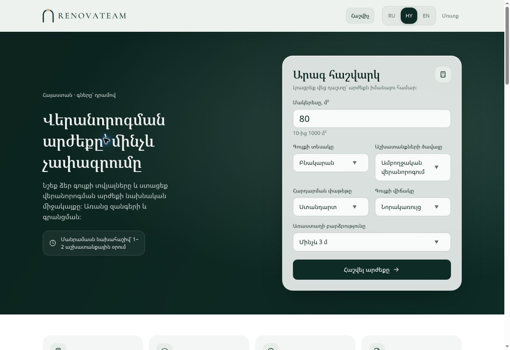

# RenovateAM — UI/UX и исправления, 7 сентября 2026

Рабочая ветка: `codex/premium-glass-ux`. База: `dcdcbd2949ad6b22a4fa7e9604a6608af1574720`.

Изучены README, описание бренда, публичный сайт и основные сценарии frontend/API. Бизнес-логика сохранена: стандартный пакет получает предварительную вилку без регистрации, дизайнерский — индивидуальную оценку специалистом в течение 1–2 рабочих дней.

## Интерфейс

- Стеклянная фиксированная шапка и панель калькулятора: размытие фона, светлая кромка, мягкие тени. Для браузеров без blur и при уменьшенной прозрачности предусмотрен плотный фон.
- Более спокойная типографика, скруглённые поля и карточки, единые кнопки, иконки и переключатель языков.
- Плавные состояния наведения, фокуса и нажатия, появление подсказок, секций, FAQ и новых страниц. Настройка уменьшения движения учитывается.
- Выпадающие списки сохраняют нативное управление клавиатурой и касанием. Где поддерживается `base-select`, оформлен и анимирован сам список; иначе используется системный интерфейс браузера.
- Переработаны армянские тексты главной, калькулятора, результата, форм, загрузки файлов, кабинета и админки. Уточнена терминология, исправлены подсказки и названия статусов. Армянские даты больше не переходят на русский при отсутствии локали в браузере.
- Сохранены исходные файлы логотипов. Основные цвета: изумрудный `#0E2B25`, тёмный `#0C231E`, светлый `#EDF1EE`; шампань `#C9B183` остаётся в логотипе согласно `brand/README.md`.

## Найдено и исправлено

| Проблема | Что изменено |
| --- | --- |
| Возврат из результата сбрасывал параметры калькулятора | Восстанавливаются все шесть полей |
| CTA дизайнерского пакета вела к регистрации со старым расчётом | Выбор возвращает к калькулятору и применяет дизайнерский пакет, в том числе при повторном нажатии |
| Дизайнерский результат зависел от загрузки ставок | Индивидуальный сценарий отображается сразу, без автоматической суммы |
| Загрузка ставок могла зависнуть; резервные значения не были обозначены | Добавлен тайм-аут запроса и пояснение при расчёте по базовым значениям |
| Черновой и чистовой результаты обещали состав ремонта под ключ | Состав работ соответствует выбранному объёму |
| Запрет записи в sessionStorage ломал переход к результату | Есть резервное хранение в памяти вкладки; некорректные сохранённые данные отклоняются |
| ID фонового расчёта мог прийти после открытия заявки и потеряться | Перед отправкой читается актуальный ID; при его отсутствии сначала сохраняются параметры расчёта |
| Заявка могла отправляться без потерянных параметров расчёта | При ошибке сохранения показывается ошибка, данные сохраняются для повторной отправки |
| Зарегистрированный пользователь мог привязать чужой сохранённый расчёт | API проверяет владельца при создании заявки; анонимный расчёт по-прежнему можно конвертировать |
| Можно было сохранить нижнюю границу цены выше верхней | Проверка добавлена в frontend и API, включая частичный набор ставок |
| Фильтр телефона отправлял запрос при каждой букве и оставался на старой странице | Поиск применяется кнопкой или Enter и возвращает на первую страницу |
| Эффекты появления некорректно восстанавливали наблюдение в React StrictMode | Исправлен жизненный цикл IntersectionObserver |
| Корневая сборка не включала frontend | `pnpm build` собирает pricing-core, API и web |
| Netlify-прокси содержал неподставленный `$API_URL` | Правило генерируется в `_redirects` во время сборки, до SPA fallback |

Netlify не поддерживает прямую подстановку переменных в конфигурацию перенаправлений; используется рекомендуемая подстановка во время сборки. [Документация Netlify](https://docs.netlify.com/build/configure-builds/file-based-configuration/#inject-environment-variable-values).

## Проверено

| Проверка | Результат |
| --- | --- |
| `pnpm build` | Успешно: pricing-core, API, web |
| `pnpm typecheck` | Успешно |
| `pnpm lint` | ESLint, границы модулей и Prettier — успешно |
| `pnpm test` | 151 успешно: core 41, web 87, API unit 21, Netlify script 2 |
| Интеграционные тесты API | 82 пропущены: тестовая PostgreSQL не подключена |
| Пример README: 80 м², квартира, под ключ, новостройка, потолки до 3 м | 4 080 000–5 520 000 ֏ |
| Браузер, настольный экран | Калькулятор, стандартный и дизайнерский результаты, возврат к параметрам, смена языка |
| Адаптивность 390 и 320 px | Армянские подписи, меню и длинные значения; горизонтального переполнения нет |

Скриншот снят с локальной версии. Мобильная проверка выполнена в узких браузерных фреймах; отдельные прогоны на физическом iPhone/Safari не проводились. Проверка реального входа, писем, загрузки в R2 и полного цикла заявки требует тестовой инфраструктуры. В репозитории пока нет команды `test:e2e`, хотя README предусматривает её как условие мержа; этот gate нельзя считать пройденным.

## Перед публикацией

1. Отправить ветку на GitHub и открыть PR. В текущей сессии доступно чтение публичного репозитория, но отправка ветки остановилась на отсутствии авторизации; удалённая ветка и PR не созданы.
2. В Netlify проверить переменную `API_URL` с областью **Builds**: HTTPS-origin действующего API без `/api/v1`. Скрипт останавливает сборку при отсутствии или некорректном значении.
3. На тестовой инфраструктуре выполнить интеграционные проверки и проверить вход, подтверждение почты, отправку заявки и загрузку файла. Backend-исправления требуют отдельного релиза API на Railway.

Изменения не опубликованы на рабочем сайте. Новых зависимостей и изменений ценовой формулы нет.
